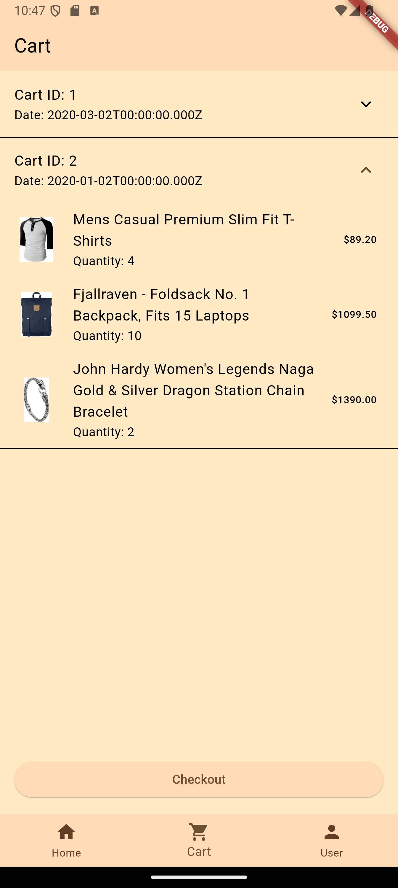
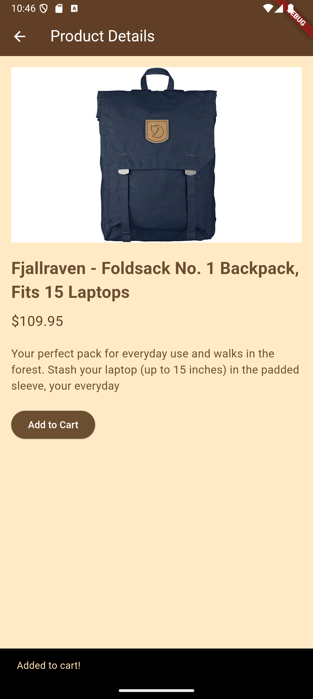
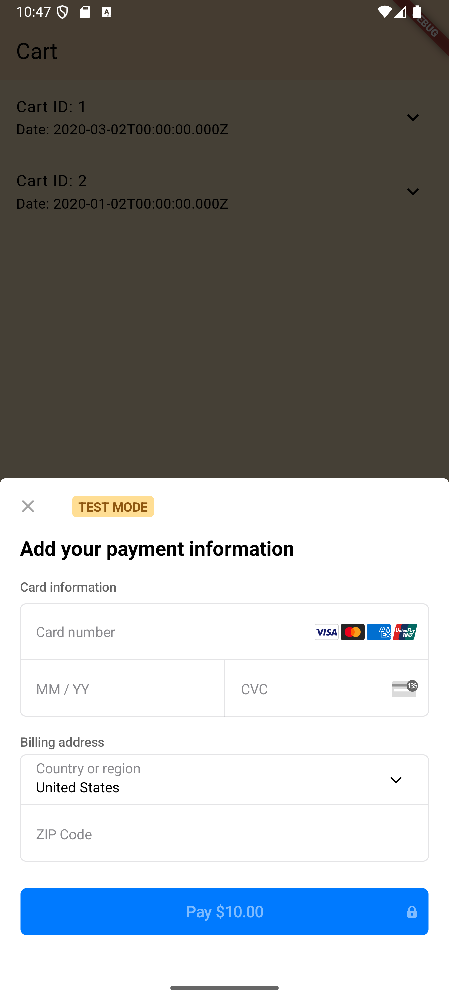

# Flutter eCommerce App with Fashion Store Api and Stripe Payment Integration

This project is an **eCommerce app** built with Flutter, featuring **cart management**, **product browsing**, and **user profiles**. The app is integrated with the **Stripe API** in test mode for handling payments. 

The backend for fetching products and user details is powered by **Fashion Store APIs** provided by [MohammadReza Keikavousi](https://github.com/keikaavousi).

---

## Features

- **Product Listing**: Users can browse through a collection of fashion products.
- **Add to Cart**: Users can add products to their cart for later purchase.
- **Cart Management**: Users can view, edit, and remove items from their cart.
- **Checkout with Stripe**: Integrated Stripe API for processing payments in test mode.
- **User Profiles**: Users can manage their profile, and view their purchase history.
- **Responsive UI**: The app is designed to work seamlessly across different devices and screen sizes.

---

## Screenshots

| Screens                       | Screens                          | Screens                        |
| --------------------------------- | ---------------------------------------- | ---------------------------------- |
|  |     |   |
|     |  |  

---

## Getting Started

Follow these instructions to get a copy of the project up and running on your local machine.

### Prerequisites

- **Flutter SDK**: [Install Flutter](https://flutter.dev/docs/get-started/install)
- **Dart**: Make sure Dart is installed along with Flutter.
- **Stripe Account**: Create a [Stripe account](https://stripe.com) to obtain API keys.
- **Riverpod Package**: Add `flutter_riverpod` for state management.

### Installation

1. Clone the repository:

   ```bash
   git clone https://github.com/Hami0095/Eu-Buy.git
